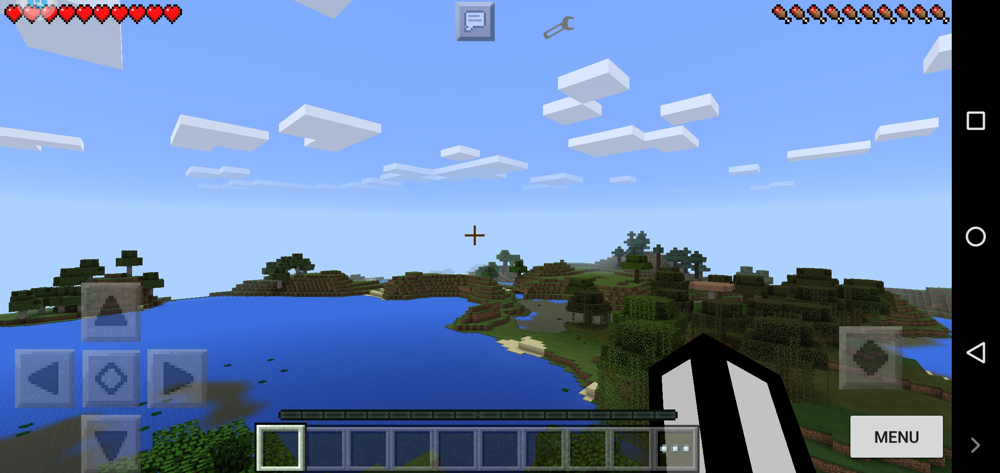
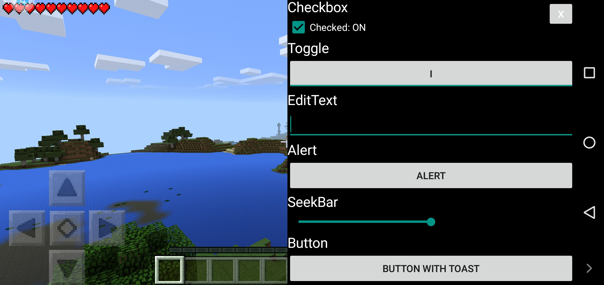

# ModPE-Menu-Template

A simple script to create a debug menu in older versions of Minecraft: PE. You need to run it in the Block Launcher application (You definitely need an installed Minecraft client)
If BlockLauncher crashes, you should run it in the VMOS PRO emulator on version 5.1. The fact is that the BlockLauncher application was created for very old devices and it will not work on new ones.
You can study the dump of functions here: https://duggum .github.io/modpe-api/index.html

Screenshot with the button

Screenshots with GUI

