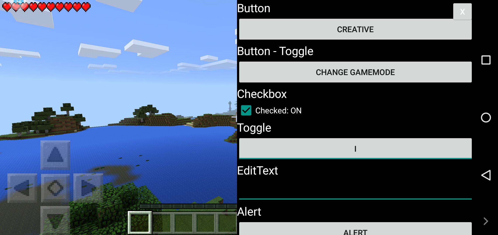

# ModPE-Menu-Template

A simple script to create a debug menu in older versions of Minecraft: PE. You need to run it in the Block Launcher application (You definitely need an installed Minecraft client)
If BlockLauncher crashes, you should run it in the VMOS PRO emulator on version 5.1. The fact is that the BlockLauncher application was created for very old devices and it will not work on new ones.
You can study the dump of functions here: https://duggum.github.io/modpe-api/index.html

Screenshot with the button

Screenshots with GUI

Only two hooks are shown in the script:
* newLevel - called entering the world
* leaveGame - called when exiting the world
To explore other examples of GUI and Hook functions, I will leave links to documentaries.

Links to programs:
* ModPE Docs 2019.1.1: https://oxy.st/d/PFGh
* ModPE BooK 2.7: https://oxy.st/d/UFGh
* ModPE Book 1.6: https://oxy.st/d/WFGh
* ModPE And Addons Book 1.0: https://oxy.st/d/XFGh
